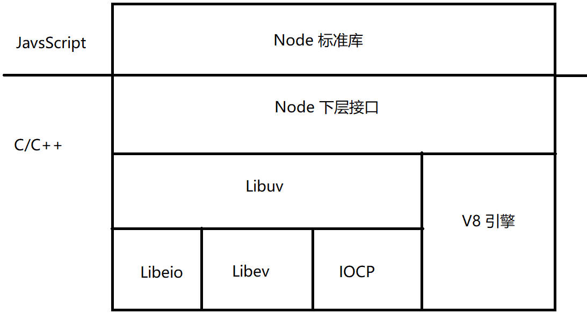
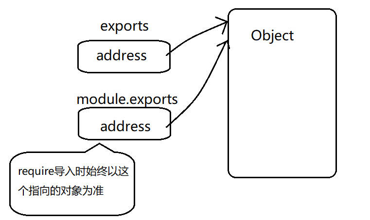
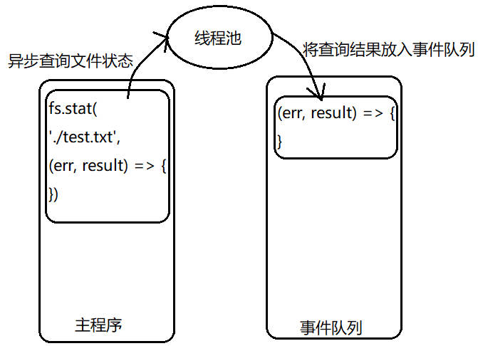

# 这是对 nodejs 更加详细的 b 补充笔记

## 1. 运行 nodejs

1. 交互模式（REPL 模式）

- Read-Evaluate-Print-Loop
- 读取用户的输入，读取一行，执行一行，输出执行的结果，继续下一次循环
- 交互模式下，node.js 内置模块无需引入

```
// 在命令行中输入 node 进入交互模式
> node

// 接着输入要执行的语句
> console.log('hello node.js')

// 按下回车执行语句
> hello node.js
> undefined

// 循环等待下一次输入
>

// 输入 .exit 回车退出交互模式
> .exit
```

2. 脚本模式

- 将所有的语句编写在一个独立的 js 脚本文件中，一次性引入执行
- 脚本模式下，除了全局对象及相关成员，所有其他模块中声明的对象和方法都必须使用 `require()` 引入

```
> node <jsScriptName>.js
```

## 2. 使用 nodejs

### 2.1 nodejs 的体系结构



### 2.2 nodejs 语法概览

- nodejs 的语法是完全基于 JavaScript 的，下列内容与 js 是完全一致的

  - 数据类型
  - 声明变量和常量
  - 运算符
  - 逻辑结构
  - 函数作用域和闭包
  - 对象和原型
  - 对象分类

- 数据类型

  - 原始类型（Primitive Type）
    - string, number, boolean, null, undefined
  - 引用类型（Reference Type）
    - ES 核心对象：Global, String, Boolean, Number, Date, Math, Array, Error, Function, Object, RegExp
    - Node.js 对象：Buffer, ReadStream, ClientRequest...
    - 自定义对象

### 2.3 nodejs 特点

- 简单，避免过度设计
- 单线程逻辑处理
- 非阻塞式的异步 I/O 处理
- 事件驱动编程
- 无锁机制，不会产生死锁
- 支持数万个并发连接
- nodejs 适合搭建**以 I/O 操作为主（数据库），响应速度快，易于扩展**的网络应用，例如：
  - 命令行工具
  - 带有 GUI 界面的本地应用程序
  - 交互式终端程序
  - 单元测试工具
  - 基于社交网络的大规模 web 应用
  - Web Socket 服务器（不同于传统 web 服务器，web socket 服务器可以主动向客户端发送数据）
  - TCP/UDP 套接字程序
  - 客户端 JavaScript 编译器
- nodejs 不适合 **cpu 密集型应用**，因为 JavaScript 是一个单线程的语言，cpu 利用率不高，例如：
  - 深层次的嵌套和递归
  - 复杂的加密和解密算法
  - 高可靠性运算
  - 严格内存管理
  - 数据挖掘和数据分析

## 3. nodejs 全局对象

### 3.1 global 对象

1. 在交互模式下，使用 `var` 定义的变量和使用 `function` 定义的函数将会被定义在 global 上，这和前端 js 的全局 window 对象是一样的

```
> var a = 1
> undefined
> function func() {return 2}
> undefined
> global.a
> 1
> global.func()
> 2
```

2. 在脚本模式下，使用 `var` 定义的变量和使用 `function` 定义的函数都不是 global 上的，原因是一个 js 文件就是一个模块，模块内只要不暴露的变量和函数都不会被外部访问到，所以不应该是全局的

```js
var a = 1
function func() {
  return 2
}
console.log(global.a) // undefined
console.log(global.func()) // Error: global.func is not defined
```

---

注意：在 nodejs 中，js 脚本文件的后缀名可以是任何字母串，甚至可以没有，但在前端 js 中，js 文件后缀名必须是 .js，这也是 nodejs 和前端 js 不同的一点

```
> node jsScriptName
> node jsScriptName.js
> node jsScriptName.abcd
// 以上都是可以的
```

---

### 3.2 console 对象

- console 中的常用方法

|         常用方法         |                                 作用                                 |
| :----------------------: | :------------------------------------------------------------------: |
|      console.log()       |                               打印日志                               |
|      console.info()      |                               打印消息                               |
|      console.warn()      |                               打印警告                               |
|     console.error()      |                               打印错误                               |
|  console.time('label')   |                     开始计时，用于统计代码段耗时                     |
| console.timeEnd('label') | 结束计时，用于统计代码段耗时，注意参数应该和之前的 time 方法参数一致 |

### 3.3 process 对象

- 相关属性
  - process.platform 查看当前操作系统平台（win32）
  - process.arch 查看当前操作系统架构（x64）
  - process.version 查看当前 nodejs 版本号（v18.16.0）
  - process.env 查看当前系统环境变量
  - process.pid 查看自己的进程编号
- 相关方法
  - process.kill(PID) 杀死进程编号 PID 所对应的进程
  - process.nextTick(() => { /_ do something _/ }) 将回调函数放到主程序的最后执行（即下一轮事件循环开始前执行，类似于 setImmediate，但要比 setImmediate 还要先执行）

### 3.4 Buffer 对象

- 缓冲区：在内存中临时存储数据的区域，常用于网络传输时的资源
- 申请一个 Buffer

```js
// number: 表示要申请的 Buffer 大小
// data: 表示字符串类型的数据
// const buf = Buffer.alloc(num: number, data: string)
// 例如：申请一个大小为 6 个字节，内容为 'abcdef' 的 Buffer
const buf = Buffer.alloc(6, 'abcdef')
```

- 在 Buffer 中，一个英文字符占一个字节，一个中文字符占三个字节，当传入的字符串长度超过给定的 Buffer 大小时，多出的字符会被丢弃，当传入的字符串长度小于给定的 Buffer 大小时，会将传入的字符串重复存储直到占满 Buffer 为止
- 将 Buffer 数据转为字符串类型数据，可以使用 `Buffer.prototype.toString()` 或者 `String(buf: Buffer)` 方法

```js
const buf = Buffer.alloc(6, 'abcdef')
console.log(buf.toString())
// 或者
console.log(String(buf))
```

## 4. nodejs 全局函数

### 4.1 timers 定时器相关

1. setTimeout 一次性定时器

```js
const timerId = setTimeout(() => {
  /* do something */
}, delay)
```

2. clearTimeout 清除一次性定时器

```js
clearTimeout(timerId)
```

3. setInterval 周期定时器

```js
const timerId = setInterval(() => {
  // do something
}, cycle)
```

4. clearInterval 清除周期定时器

```js
clearInterval(timerId)
```

5. setImmediate 立即执行定时器

- 立即执行的定时器的作用：将定时器中的任务丢到消息队列中去

```js
const timerId = setImmediate(() => {
  // do something
})
```

6. clearImmediate 清除立即执行定时器

```js
clearImmediate(timerId)
```

## 5. module 模块系统

### 5.1 模块

- 一个模块就是一个独立的功能体，在 nodejs 中，一个 js 文件就是一个模块
- nodejs 中的模块有三类
  - 自定义模块
  - 内置（核心）模块
  - 第三方模块

### 5.2 模块化的原理

- 相当于使用了一个匿名的构造函数将 js 文件中的代码包裹起来了

```js
// 在一个 js 模块中
;(function () {
  // ...
  // 模块代码
  // ...
})
```

- 正是因为 js 代码相当于被一个匿名构造函数包裹起来，所以在模块里定义的变量和函数不是全局的，属于局部作用域，不能被外部访问
- 在这个匿名构造函数中被传递了五个参数

```js
;(function (exports, require, module, __filename, __dirname) {
  // 模块代码
})
```

- 这五个参数的作用：

  - require：用于引入其他模块

  ```js
  const moduleName = require(pathStr)
  ```

  - exports: 用于暴露模块中的内容，默认暴露的是一个空对象，可以通过向这个对象身上挂载属性和方法的方式将模块内部的数据暴露出去，其它模块使用 require 导入的便是这个对象

  ```js
  // one.js
  const data = 'this is a data in one'
  exports.data = data

  // two.js
  const one = require('./one')
  console.log(one) // { data: 'this is a data in one' }
  ```

  - module: 是一个对象，代表当前模块信息，里面有一个 `module.exports` 属性，这个属性才是真正的使用 require 导入时的对象，只不过 exports 和 module.exports 指向的是同一个对象而已，而当 exports 和 module.exports 指向的对象发生变化而导致指向的不是同一个对象时，导入时始终以 module.exports 指向的对象为准

  ```js
  // one.js
  exports = { a: 1 }
  module.exports = { a: 2 }

  // two.js
  const one = require('./one')
  console.log(one) // { a: 2 }
  ```

  

  - \_\_dirname：当前目录的绝对路径

  ```js
  console.log(__dirname) // D:\frontend_project\nodejs\04__module
  ```

  - \_\_filename：当前文件的绝对路径

  ```js
  console.log(__filename) // D:\frontend_project\nodejs\04__module\moduleDemo.js
  ```

### 5.3 模块的分类和引入

这里在 [nodejs 笔记.md](./nodejs笔记.md) 的模块加载机制中有比较详细的笔记，在此不重复记录

- 注意：以路径引入的都是自定义模块（不管是文件模块还是目录模块），不以路径引入的是内置模块或第三方模块

## 6. nodejs 中的包和 npm

### 6.1 概念：

- CommonJs 规范：js 向服务端发展所遵循的规范，例如模块作用域，导入导出都是 CommonJs 规范下的
- 包：一个包就是一个目录模块
- npm：用于管理包的工具（node package management）

## 7. 一些内置的工具模块

### 7.1 查询字符串模块 querystring

1. 引入模块

```js
const qsModule = require('querystring')
```

2. 使用模块

- 将查询字符串解析为对象

```js
const qObj = qsModule.parse(qStr)
```

- 将对象格式化为查询字符串

```js
const qStr = qsModule.stringify(qObj)
```

### 7.2 url 模块

1. 引入模块

```js
const urlModule = require('url')
```

2. 解析 url

```js
// 该方法已弃用
const urlObj = urlModule.parse(urlStr)
```

3. 将一个对象格式化为一个 url 字符串

```js
const urlStr = urlModule.format({
  protocol: 'http',
  hostname: 'www.baidu.com',
  port: '80',
  pathname: 'index.html',
  query: {
    username: 'Dylan Meyer',
  },
})
```

## 8 文件系统模块 fs

1. 引入模块

```js
const fsModule = require('fs')
```

2. fs 模块一些 api

- fs.stat(path[, options], (err, result) => {}) 异步查看文件状态
  - result.isFile() 是否是一个文件
  - result.isDirectory() 是否是一个目录

```js
fs.stat(__dirname + '/testFile.json', (err, result) => {
  if (err) {
    console.log(err)
    throw err
  }

  console.log(result)
})
```

- fs.statSync(path[, options]) 同步查看文件状态

```js
try {
  const result = fs.statSync(__dirname + '/testFile.json')
  console.log(result)
} catch (err) {
  console.log(err)
}
```

---

nodejs 中的同步和异步：
异步操作会被放入线程池中进行多线程操作，操作完成后，会将操作结果以回调函数的形式放入事件队列，等待主程序调用



---

- fs.mkdir(path[, options], (err) => {}) 异步创建目录

```js
fs.mkdir(__dirname + '/testDir', err => {
  if (err) throw err
  console.log('mkdir success')
})
```

- fs.mkdirSync(path[, options]) 同步创建目录

```js
fs.mkdir(__dirname + '/testDir')
```

- fs.rmdir(path[, options], (err) => {}) 异步移除目录

```js
fs.rmdir(__dirname + '/testDir', err => {
  if (err) throw err
  console.log('remove success')
})
```

- fs.rmdirSync(path[, options]) 同步移除目录

```js
fs.rmdirSync(__dirname + '/testDir')
```

- fs.readdir(path[, options], (err, result) => {}) 异步读取目录
  - result 是一个字符串数组，保存从该目录下读取到的文件和目录的字符串名

```js
fs.readdir(__dirname + '/testDir', (err, result) => {
  if (err) {
    throw err
  }

  console.log(result)
})
```

- fs.readdirSync(path[, options]) 同步读取目录

```js
const result = fs.readdirSync(__dirname + '/testDir')
```

- fs.writeFile(path, data[, options], (err) => {}) 异步写入文件内容，如果没有该文件则创建

```js
const jsonObj = {
  name: 'Genevieve Cannon',
  age: 18,
}

fs.writeFile(
  __dirname + '/testFile.json', // path
  JSON.stringify(jsonObj), // data
  { encoding: 'utf-8', flag: 'a' }, // options
  err => {
    // callback
    if (err) throw err
  },
)
```

- fs.writeFileSync(path, data[, options]) 同步写入文件内容，如果没有该文件则创建

```js
const jsonObj = {
  name: 'Genevieve Cannon',
  age: 18,
}

fs.writeFile(__dirname + '/testFile.json', JSON.stringify(jsonObj), {
  encoding: 'utf-8',
  flag: 'a',
})
```

- fs.appendFile(path. data[, options], (err) => {}) 异步向文件中追加内容，如果没有该文件则创建

```js
fs.appendFile(
  __dirname + '/testFile.json',
  'hello world',
  { encoding: 'utf-8' },
  err => {
    if (err) throw err
  },
)
```

- fs.appendFileSync(path, data[, options]) 同步向文件中追加内容，如果没有该文件则创建

```js
fs.appendFileSync(__dirname + '/testFile.json', 'hello world', {
  encoding: 'utf-8',
})
```

- fs.readFile(path[, options], (err, data) => {}) 异步读取文件内容，data 是 Buffer 类型数据

```js
fs.readFile(__dirname + '/tsetFile.json', (err, data) => {
  if (err) throw err

  console.log(data.toString())
})
```

- fs.readFileSync(path[, options]) 同步读取文件内容，返回的是 Buffer 类型数据

```js
const data = fs.readFileSync(__dirname + '/testFile.json')
```

- fs.unlink(path, (err) => {}) 异步删除一个文件

```js
fs.unlink(__dirname + '/testFile.json', err => {
  if (err) throw err
})
```

- fs.unlinkSync(path) 同步删除一个文件

```js
fs.unlinkSync(__dirname + '/testFile.json')
```

- fs.existsSync(path) 检测文件或目录是否存在，其异步方法已被废弃

```js
const exists = fs.existsSync(__dirname + '/testFile.json')
console.log(exists) // false / true
```

- fs.copyFile(srcPath, destPath[, flags], err => {}) 异步拷贝一个文件的内容

- fs.copyFileSync(srcPath, destPath[, flag]) 同步拷贝一个文件的内容

- 更多 api 参考 [nodejs 中文文档](https://nodejs.cn/api/)

## 9 Stream 模块

### 9.1 读取流：createReadStream(path)

1. 引入模块

```js
const fs = require('fs')
```

2. 创建读入流

```js
const rStream = fs.createReadStream(__dirname + '/testFile.txt')
```

3. 通过监听 `data` 事件来分块读取数据，chunk 是 Buffer 类型数据

```js
rStream.on('data', chunk => {
  console.log(chunk.toString())
})
```

4. 通过监听 `end` 事件来关闭流

```js
rStream.on('end', () => {
  rStream.close()
})
```

### 9.2 写入流 createWriteStream

1. 引入模块

```js
const fs = require('fs')
```

2. 创建写入流，如果指定的文件不存在，则创建

```js
const wStream = fs.createWrite(__dirname + '/testFile.txt')
```

3. 使用 `wStream.write(chunk, (err => {})?)` 来写入数据

```js
wStream.write(chunk)
```

4. 使用 `wStream.close()` 来关闭流

### 9.3 使用 `rStream.pipe(wStream)` 可以方便的将一个读取流中的数据赋值到写入流

### 9.4 通过监听 `readable` 事件逐个字节读取文件

```js
const fs = require('fs')

const rStream = fs.createReadStream(__dirname + '/testFile.txt')

rStream.on('readable', () => {
  let tempByte = null

  // 1 表示每次读取一个字节，放到一个 Buffer 中
  while ((tempByte = rStream.read(1)) !== null) {
    console.log(tempByte)
  }
})
```

### 9.5 通过 `readline` 模块按行读取数据

```js
const fs = require('fs')
const readline = require('readline')

// 相当于一个包装流
const rStream = readline.createInterface({
  input: fs.createReadStream(__dirname + '/testFile.txt')
})

rStream.on('line', line => {
  // 读出来的 line 是字符串类型
  console.log(line)
})
```

## 10. 